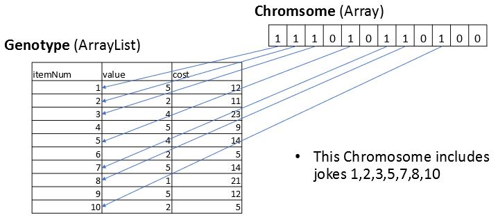

# Genetic-Algorithm

Genetic-Algorithm is a Java implementation of a generic algorithm for solving the [Knapsack](https://en.wikipedia.org/wiki/Knapsack_problem) genre of [NP-Complete](https://en.wikipedia.org/wiki/NP-completeness) problems.

It implements each of the major crossover and selection methods, which makes it ideal for comparing the performance of the various ways genetic algorithms can be implemented and ideal for educational purposes.

This readme includes a detailed introduction to how Genetic Algorithms work

## Optimality and Justification for Genetic Algorithm

The advantage of Genetic Algorithm is that it can find a "good" solution the NP-Complete problem in constant time O(n), which would otherwise take exponential O(2^n) time to find a perfect solution. The [Big O](https://en.wikipedia.org/wiki/Big_O_notation) estimation of the algorithm is detailed as follows. Each of the variables are parameters which can be tuned

### Time Complexity

O(G(p(pc) + 2pc + p(p-pc) + pg)

* G: the number of generations
* p: the population size
* c: the crossover rate
* g: the number of genes per Chromosome

### Space Complexity

O(p + 2pc + p-pc )
* p: the population size
* c: the crossover rate
* p-pc: is the number of survivors

## Usage

*Note: you can modify the Genotype class if you want to have a custom evaluation*

### Data (Genotype)

The current structure of items evaluated is an int **itemNum** which is a unique identifier for the item, an int **value** which represents how much benefit you would get from the item, and an int **cost** which represents how much capacity the item will take. The data can be provided as a *csv* file in the current directory (data.csv) or with the **add** method of the **Genotype** class:

```java
Genotype Knapsack = new Genotype();
Knapsack.add(itemNum, value, cost);
```

The algorithm seeks to maximize the sum of **value** of all selected items while keeping the sum of **cost** as close to a parameter value **idealCostSum**, which is the ideal sum of the selection's cost, as possible. You can set the **idealCostSum* with the **setIdealCostSum** method of the **Genotype** class:

```java
Genotype Knapsack = new Genotype();
Knapsack.setIdealCostSum(idealCostSum);
```

In the [Wikipedia example](https://en.wikipedia.org/wiki/Knapsack_problem#/media/File:Knapsack.svg) the **value** is a US dollar value of the item, and the **cost** is the weight of the item in kg. The algorithm would take a list of items and make a selection of them which has the highest total US dollar value while maintaining a total weight of approximately 15kg:


| itemNum | value | cost | Description             |
| ------- |:----- |:---- |:----------------------- |
| 1       | 4     | 12   | $4 item that takes 12kg |
| 2       | 2     | 1    | $2 item that takes 1kg  |
| 3       | 10    | 4    | $10 item that takes 4kg |
| 4       | 2     | 2    | $2 item that takes 2kg  |
| 5       | 1     | 1    | $1 item that takes 1kg  |


This dataset could be provided to the application as a *data.csv* file with the **importCSV** method of the **Genotype** class. Alternatively it can be provided with the **add** method of the **Genotype** class:
```java
Genotype Knapsack = new Genotype();
Knapsack.add(1,4,12);
Knapsack.add(2,2,1);
Knapsack.add(3,10,4);
Knapsack.add(4,2,2);
Knapsack.add(5,1,1);
```

Our example dataset imagines a comedian deciding which jokes to tell in a half hour (30 minute) performance. The **value** is his rating on a 1-5 scale of how funny the joke is, and the **cost** is how long it takes him to tell the joke. The algorithm would take the list of jokes and make a selection which has the highest total joke rating while maintaining a total time of approximately 30 minutes:

|itemNum  |value  |cost  |Description|
| ------- |:----- |:---- |:----------------------- |
|1|5|5|A 5/5 rated joke that takes 5 minutes to tell|
|2|2|1|A 2/5 rated joke that takes 1 minute to tell|
|3|4|4|A 4/5 rated joke that takes 4 minutes to tell|
|4|5|3|A 5/5 rated joke that takes 3 minutes to tell|
|5|4|1|A 4/5 rated joke that takes 1 minute to tell|
|6|2|1|A 2/5 rated joke that takes 1 minute to tell|
|7|5|4|A 5/5 rated joke that takes 4 minutes to tell|
|8|1|1|A 1/5 rated joke that takes 1 minute to tell|
|9|5|2|A 5/5 rated joke that takes 2 minutes to tell|
|10|2|7|A 2/5 rated joke that takes 7 minutes to tell|

As with the Wikipedia example this can be provided as a *data.csv* file or with the **add** method of the **Genotype** class.

## Customization

All of the problem specific code is in the **Genotype** class. If, for example, you want to change the algorithm to instead try to minimize **value** to be as small as possible you can change the **calculateFitness** method of the **Genotype** class to do that. But make sure that **calculateFitness** returns an *positive* integer such that a higher value is better.

You can make significant changes/customization to both **Genotype** and **Item** classes without impacting the rest of the application. There is an example included named **Exam-Genotype.java** and **Question-Item.java** which rewrites the **Genotype** and **Item** classes for an example which has items with the structure Question Number, Textbook Section, Estimated Time To Solve and has a calculateFitness which a attempts to choose exam Questions which cover the Textbook Sections as evenly as possible and has an Estimated Time To Solve as close to an ideal time **idealAssignmentTime**.

Detailed information on how this all works are provided in this readme!

## Algorithm and Execution

The actual algorithm for executing the program are in the **GeneticAlgorithm** class. It allows you to specify one crossover method and one selection method, but you can easily modify it to combine various crossover or selection methods.

GeneticAlgorithm **standardAlgorithm** takes the following arguments. It returns a String listing the top solution and prints it to Standard.out. The standard format for the return values is CSV format with the header "itemNum,value,cost,fitnessScore: ####" followed by all items listed one per line in the format "itemNum,value,cost". Review the documentation about each topic (population, crossover methods, selection methods) in this readme for more information:
* genotype: a *Genotype* class that has your items
* populationSize: an *int* of the size of the initial population
* crossoverRate: a *double* of the crossover rate (the number of children that will be produced per generation) this is typically around 0.6
* mutationRate: a *double* of the mutation rate (the chance of any given gene being having its value flipped from 0 to 1 or visa versa)  suggested values are between 0.001 - 0.05
* crossoverMethod: a *string* specifying the crossover method to be used. This is case insensitive and ignores spaces. It can be one of:
  * "singlePoint"
  * "twoPoint"
  * "threePoint"
  * "random"
* selectionMethod: a *string* specifying the selection method to be used. This is case insensitive and ignores spaces. It can be one of:
  * "rolluletteWheel"
  * "tournament"
  * "ranked"
* selectBest: an *int* specifying the number of top performing solutions should be preserved each generation. This makes it so we never lose the best performing solutions of a generation
* generationCount: an *int* of the number of generations should be executed before the algorithm stops and returns a solution
* fitnessTarget: an *int* of a value returned from Genotype.calculateFitness that if reached will stop the algorithm and return the solutions. For no fitnessTarget enter 0. A generationCount must also be specified to prevent an infinite loop
* printLevel: an *int*, if greater than 0 the application will print information to System.out as the algorithm runs. If 0 no information will be printed

Example output:  
itemNum,value,cost,fitnessScore: 1600  
1,5,5  
2,2,1  
3,4,4  
4,5,3  
5,4,1  
6,2,1  
7,5,4  
8,1,1  
9,5,2  
10,2,7  

First, you will need to create a **Genotype** object, add **Item**s to it, and set an ideal cost sum:
```Java
Genotype Knapsack = new Genotype();
Knapsack.importCSV("data.csv");
Knapsack.setIdealCostSum(15); // 15 kg
```

Then you need to initialize a GeneticAlgorithm object and execute the algorithm:
```Java
GeneticAlgorithm GA = new GeneticAlgorithm();
GA.standardAlgorithm(Knapsack, populationSize, crossoverRate, mutationRate,
                     crossoverMethod, selectionMethod, selectBest, generationCount,
                     fitnessTarget, printLevel);
````

Example values
```Java
GeneticAlgorithm GA = new GeneticAlgorithm();
GA.standardAlgorithm(Knapsack, 500, 0.6, 0.05,
                     "singlePoint", "rouletteWheel", 10, 20,
                     fitnessTarget, printLevel);
````  

GeneticAlgorithm **standardAlgorithmTop10** has the same parameters and performs the same operation as **standardAlgorithm** but returns a Population object containing the top 10 performing Chromosomes

# Genetic-Algorithm Described In Detail

## What is a Genetic Algorithm?
Genetic Algorithms simulate the basic concepts of evolution to find “good” solutions to problems.

Some solutions to the problem are generated. We call these Chromosomes.

We then perform a loop where we:
  * Choose some of the best solutions (chromosomes) to be parents
  * Generate new solutions, children, by combining the elements of parents
  * Choose the best solutions as “survivors”, and eliminate weakest solutions
  * Loop

## Our example problem (jokes setlist)

Consider a comedian who is choosing what jokes to include in their performance.

The available jokes are listed with the following information:
* An ID number for the joke
* How funny the joke is on a scale of 1-5
* How long it takes to tell the joke

Can we find a selection of jokes that
* Will fit in an approximately 30 minute (half hour) performance
* Has the best possible joke ratings

## Phenotype / Genotype / Chromosome

The **Phenotype** is the term we give for the real life problem. This would be the list of jokes described previously.

A **Genotype** is the computer representation, where we code the phenotype as an array or similar type of object. Internally we store this as an arraylist of Item objects.

A **Chromosome** is a solution representation, where we create an array which lists which questions, from the Genotype, we have selected

## Example Genotype
The first 10 jokes from our example dataset look like this. The description column is not actually in the dataset but added to make it easier to understand:

|itemNum  |value  |cost  |Description|
| ------- |:----- |:---- |:----------------------- |
|1|5|5|A 5/5 rated joke that takes 5 minutes to tell|
|2|2|1|A 2/5 rated joke that takes 1 minute to tell|
|3|4|4|A 4/5 rated joke that takes 4 minutes to tell|
|4|5|3|A 5/5 rated joke that takes 3 minutes to tell|
|5|4|1|A 4/5 rated joke that takes 1 minute to tell|
|6|2|1|A 2/5 rated joke that takes 1 minute to tell|
|7|5|4|A 5/5 rated joke that takes 4 minutes to tell|
|8|1|1|A 1/5 rated joke that takes 1 minute to tell|
|9|5|2|A 5/5 rated joke that takes 2 minutes to tell|
|10|2|7|A 2/5 rated joke that takes 7 minutes to tell|

## Example Chromosome
Array with one index per Genotype element. Each array value is a “gene”, and indicates whether that Genotype item is included in the solution (1 if included, 0 otherwise)

| 1 |	1 |	1 |	0 |	1 |	0 |	1 |	1 |	0 |	1 |	0 |	0 |
|-|	-|	-|	-|	-|	-|	-|	-|	-|	-|	-|	-|

## Decoding
For each Chromosome index, if that index is 1 the Genotype question is selected. The following image demonstrates this:


## Evaluating fitness
For the Genetic Algorithm to choose good Chromosomes as parents and survivors we need a way to compare them. We do this with a “Fitness Function”.

We use the Genotype to decode Chromosome elements and evaluate how well the solution solves our problem, and quantify it as an integer score.

The score should be a positive integer or double where a higher score means better fitness.

We could make a function where lower scores are better, but the popular selection algorithms require positive numbers

## Fitness Function for our example
We want to keep our overall cost (time) to be as close to 30 as possible, and our total value (joke ratings) to be as high as possible

**To measure cost**: since our ideal cost sum is 30 minutes, we can calculate the sum of cost from all of the items that are in the solution, subtract it from 30 and square. This will result in the solutions closest to 30 cost having lower values and solutions farther from 30 having higher values. Since we need our scores to be such that higher is better, we take a large number and subtract this value from it. In our implementation we sum all of the cost from the entire Genotype and squared it, and subsequently subtract the calculated value from that.
So, if all of our jokes combine to 400 minutes, a solution of jokes that is exactly 30 minutes will be =392^2-(30-30)^2 which is 153664. A solution of jokes that was only 20 minutes would have a score =392^2-(30-20)^2 = 153564

**To measure value**: since higher values are better we simply square the sum of value (the 1-5 joke ratings)

**weighting**: since the measurement of cost score and value score result in very different values we assign weights to each of them. The default weights are .1 for cost and .9 for value but these can be tuned

## Population
A population is simply a collection of Chromosomes. Array type objects (ArrayList) should be used for performance

## Initial Population
We start off by creating a population of size P (populationSize) of Chromosomes.

Typically random Chromosome values are used.

We could use heuristics in the generation of the initial population, but this can have the undesirable effect of “premature convergence”.  The Genetic Algorithm will naturally find the best solutions without the help of heuristics

## Choosing Parents
We calculate the fitness of each Chromosome in the Population.

We want to choose the best Chromosomes to be parents
…but it’s not as straight forward as that!

We also need to be careful to avoid “premature convergence”, in which our chromosomes become too similar too soon, local maxima.

We want to keep as much variety in our population as possible, while still favoring better solutions as parents. Our best solution may involve some genes the current top scorers do not have

### Ranked Selection
The most intuitive method for choosing parents (but it’s actually the worst).

We can simply sort the population by fitness descending, and select from the top of the list.

This will cause us to lose variety in the gene pool very quickly, causing us to reach a local maxima

### Roulette Wheel Selection
The most popular selection algorithm. Also known as “Fitness proportionate selection”.

We choose a random number between the lowest fitness value in the population and the total sum of their fitness values.

We iterate through the population circularly, with a running sum of their fitness values. When our sum reaches the randomly selected value, choose the Chromosome that caused our sum to reach it.

The Chromosomes with the highest fitness values are most likely to be chosen, but some lower fitness ones will be chosen as well


### Tournament Selection
A popular alternative to Roulette Wheel selection.

Chose K random Chromosomes from the population, choose the one with the best fitness score

### Generating Children
We combine genes from two Parent Chromosomes to generate one or two children.

**Single Point Crossover**:
The genes of the new child are the first half array indexes of one parent and the second half array indexes of the other.

Parent 1:

| **0** | **1** | **0** | **1** | **0** | 1 | 0 | 1 | 0 | 1 |
|-|-|-|	-|-|-|-|-|-|-|

Parent 2:

| 1 | 0 | 1 | 0 | 1 | **0** | **1** | **0** | **1** | **0** |
|-|-|-|-|-|-|-|-|-|-|

Child:

| 0 | 1 | 0 | 1 | 0 | 0 | 1 | 0 | 1 | 0 |
|-|-|-|-|-|-|-|-|-|-|

Two Point and Three Point Crossover are the same but divided at more points

### Random Crossover
Choose which genes to take from which parent randomly

### Choosing Survivors
We want our worst candidate solutions to fall out of the population.

The most common way to do this is to instead choose what Chromosomes will survive. This allows us to use our Parent selection algorithms, such as Roulette Wheel Selection.

We can instead reverse Tournament Selection and Ranked Selection to instead choose bad candidates and delete those chosen

### Mutation
We randomly mutate Chromosome genes each generation.

This helps us escape from a local maxima.

The most common way is to iterate through every gene of every Chromosome in the population and flip it with a chance mutationRate
* This requires Population size * genes per Chromosome operations, but array operations are very fast and it’s easy to implement.

Sources recommend values between 0.001 – 0.05 as mutation rates. I found that a higher rate significantly decreased the average number of generations required for a near optimal solution

### Parameters
* Population size: the size of the population
* Crossover Rate: the number of children that will be produced
* Mutation Rate: the rate of mutations
* Stop condition: when we will stop
  * This is often a certain number of generations
  * It can also be a fitness score we want to reach
    * To avoid an infinite loop you may want to also want to restrict by generations

## The algorithm we implemented
* Create a random population
* While best score is < #
  * New population parents: Select (Population size * crossover Rate) Chromosomes as parents
  * New population children: for every two chromosomes in the parents population generate two new chromosomes using crossover
  * New population survivors: Select (Population size - number of children) from the population to survive
  * Combine the new populations as the new base population and loop

## Compare it to brute force
Example of a brute force O(2^n) method for a set of just 20 items:
```Java
int maxScore = 0;
    for (int i = 0; i < 2; i++)
      for (int j = 0; j < 2; j++)
        for (int k = 0; k < 2; k++)
          for (int l = 0; l < 2; l++)
            for (int m = 0; m < 2; m++)
              for (int n = 0; n < 2; n++)
                for (int o = 0; o < 2; o++)
                  for (int p = 0; p < 2; p++)
                    for (int q = 0; q < 2; q++)
                      for (int r = 0; r < 2; r++)
                        for (int s = 0; s < 2; s++)
                          for (int t = 0; t < 2; t++)
                            for (int u = 0; u < 2; u++)
                              for (int v = 0; v < 2; v++)
                                for (int w = 0; w < 2; w++)
                                  for (int x = 0; x < 2; x++)
                                    for (int y = 0; y < 2; y++)
                                      for (int z = 0; z < 2; z++)
                                        for (int a = 0; a < 2; a++)
                                          for (int b = 0; b < 2; b++) {
                                            int[] bitstring = new int[] {i, j,  k,  l,  m,  n,  o,  p,  q,  r,  s,  t,  u,  v,  w,  x,  y,  z,  a,  b};
                                            Chromosome c = new Chromosome(bitstring);
                                            int score = genotype.calculateFitness(c);
                                            if (score > maxScore)
                                              maxScore = score;
                                          }
    return maxScore;
  }

```

## Contributing
Pull requests are welcome. For major changes, please open an issue first to discuss what you would like to change.

## License
[MIT](https://opensource.org/licenses/MIT)

## References
[1] Whitley, Darrell. A Genetic Algorithm Tutorial. Colorado State University.<br/>
[2] Marsland, Stephen. Machine Learning: An Algorithmic Perspective, Second Edition
(Chapman & Hall/Crc Machine Learning & Pattern Recognition) (Chapter 10). CRC Press.
Kindle Edition.<br/>
[3] Sadeghi, Javad; Sadeghi, Saeid; Taghi, Seyed; Niaki, Akhavan. Optimizing a hybrid
vendor-managed inventory and transportation problem with fuzzy demand: An improved particle
swarm optimization algorithm. Volume 272, 2014 (Pages 126-144). Information Sciences.  
